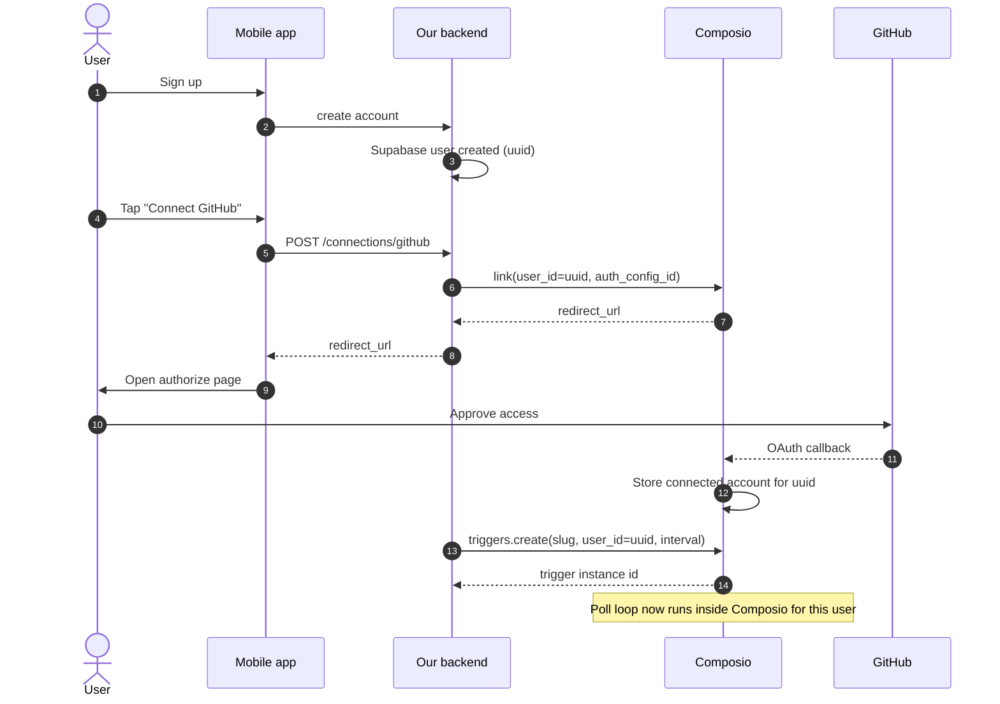
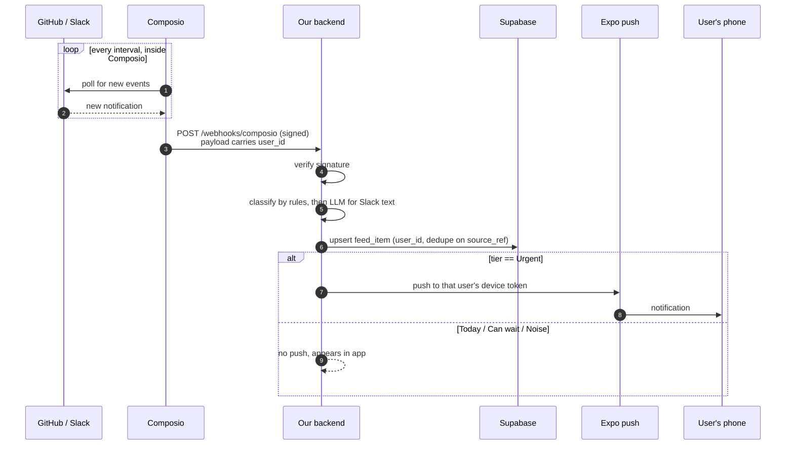
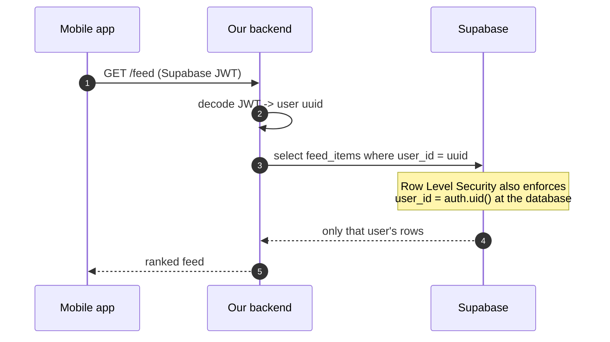
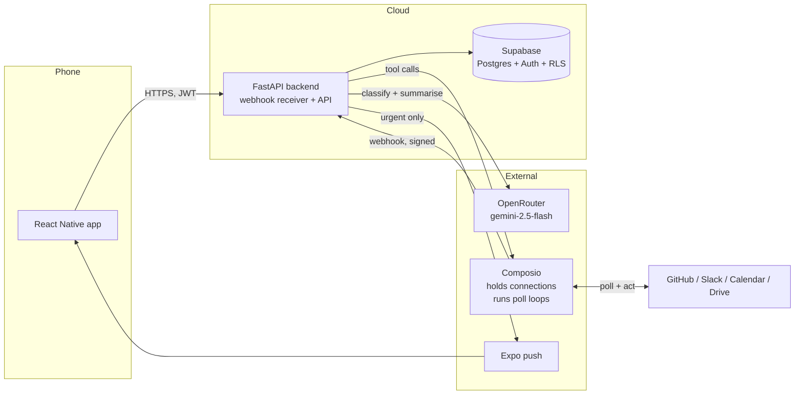

# Architecture: do we need a backend, and what runs where

**Date:** 2026-07-23
**Status:** answers the open questions. Read this before the plan.

---

## 1. The app and the backend are two separate programs

This is the core confusion, so plainly:

- **The mobile app** (React Native + Expo) is what gets installed on a phone. It is the *client*. It draws screens and calls an API.
- **The backend** (Python + FastAPI) is a *separate program running on a computer in the cloud*. It is never inside the `.apk` or `.ipa`.

They talk over HTTPS. **No Python ever ships inside the app file.** When you hand someone the app, they get the React Native client only.

```
[ Phone: React Native app ]  --HTTPS-->  [ Cloud: FastAPI backend ]  <-->  [ Supabase ]
                                                  ^
                                                  |  webhooks
                                         [ Composio ]  <-->  GitHub / Slack / Calendar / Drive
```

---

## 2. Can we skip the backend entirely?

**No.** Two reasons, and the second is absolute.

**Reason 1: secrets.** Calling Composio requires the Composio API key. Anything shipped inside a mobile app can be extracted from the binary by anyone who installs it. If the key is in the app, one person can pull it out and reach **every user's** connected accounts. API keys must live on a server. This alone forces a backend.

**Reason 2: notifications while the app is closed.** This is the one that cannot be engineered around. **An app that is not running cannot check anything.** iOS and Android suspend apps aggressively. For the phone to buzz when a PR needs your review, some always-on computer has to notice the event and tell Apple's (APNs) or Google's (FCM) push service to wake the device. That always-on computer *is* the backend. There is no version of "the app does it itself" that delivers a notification while the app is closed.

So: a backend is required. But it can be **small**, and it does not need a scheduler.

---

## 3. Prefect is not needed. Here is why.

You were right to push back, and the capability research proves it.

**Composio does the polling for us.** When Composio documents a trigger as "polling" (Gmail, Calendar, Linear private teams), that means **Composio polls Google or Linear on their own infrastructure**, then pushes the result to our webhook. From our side it is simply an inbound HTTP request. We never run a schedule, never poll a provider, never need a scheduler.

So the backend is: **a webhook receiver plus an API**. Nothing periodic runs on our side.

| Old plan (v2) | Now |
|---|---|
| Prefect flow polling GitHub every N minutes | Composio triggers push events to `POST /webhooks/composio` |
| A scheduler process to run and host | No scheduler at all |

And when the user opens the app, the app calls `GET /feed`, which can also trigger a fresh pull right then. That matches your mental model: **things happen when someone opens the app**, plus webhooks arriving in the background so notifications still work when it is closed.

> Note on the "always use Prefect" rule: that rule governs *scheduled application jobs*. We now have none, so it does not apply here.

---

## 4. What the backend actually does

Five jobs, all small:

1. **Holds the secrets** (Composio key, OpenRouter key, Supabase service key).
2. **Receives Composio webhooks** for every integration, on one endpoint.
3. **Classifies, ranks and stores** items into Supabase.
4. **Sends push notifications** through Expo's push service to APNs/FCM.
5. **Serves the app**: `GET /feed`, `GET /sources/{provider}`, `POST /items/{id}/actions`.

That is a single small service. No queue, no scheduler, no worker fleet.

---

## 5. Where to deploy it

The one hard requirement is **a stable public HTTPS URL that is always reachable**, because Composio delivers webhooks to it.

| Option | Verdict |
|---|---|
| **Small always-on container** (Railway, Render, Fly) | **Recommended to start.** About $5/month, zero ops, one stable URL, no cold starts, no timeout ceiling. |
| **AWS EC2** (t4g.small) | Also fine, and you have done it before. More control, slightly more setup. Good target once it is real. |
| **Vercel** | Works for webhooks, but serverless timeouts (10s on hobby) will bite when we batch LLM summarization. Not recommended for this shape. |

### Local first, deploy later (validated)

For the demo we do **not** deploy at all. The backend runs on your Mac and **ngrok** gives it a public HTTPS URL so Composio can reach it. This was tested end to end on 2026-07-23:

- Local listener on `:8787`, ngrok tunnel up, public URL reachable from the internet and the request logged locally.
- Webhook subscription registered with Composio against that ngrok URL.
- Trigger created; Composio's own poll loop confirmed running (see section 3).

So the order is: **everything on localhost with ngrok → demo on your phone via Expo → then EC2** when it needs to be always-on. Nothing about the local setup has to change when we deploy; only the webhook URL does.

Recommendation for eventual hosting: a small always-on container, or EC2 since you are comfortable there. Either way it is one service and one URL.

---

## 6. Categories: urgency tiers, not semantic types

Earlier drafts had two overlapping taxonomies and a "Blocked on others" bucket. **"Blocked on others" is dropped: we cannot reliably know it.** Inferring that someone else is the holdup means guessing at intent, and a category built on a guess will be wrong often enough to destroy trust. What we *can* honestly say is "your PR has been awaiting review for 4 hours", and that is a detail on an item, not a category.

The organising principle is **urgency**, because that is how the question is actually asked: *what do I have to deal with right now.*

### Home has two zones

**Zone 1: Your day.** Time-anchored, always on top. Next meeting, meetings remaining, and what is due today. From Calendar plus Linear. This is the "what is happening and what is pending for the day" view.

**Zone 2: Needs you.** Three tiers, nothing more.

| Tier | Meaning | Examples |
|---|---|---|
| **Urgent** | Someone is actively waiting on you right now | GitHub: review requested, assigned to you, @mentioned, changes requested on your PR, CI failed on your PR · Slack: a message the model judges needs an answer now · Docs: someone @mentioned you in a comment |
| **Today** | Real, should be handled today, nobody is blocked this minute | Slack message that asks something but states a later deadline · PR awaiting your review that is not blocking a release · issue due today |
| **Can wait** | Needs you eventually, no time pressure | Assigned with no deadline, non-blocking mention |

**Noise** is the fourth bucket and it **never appears on Home**. It lives in its own tab: CI passed, merged, closed, releases, channel chatter, promotions, automated mail.

### Type is a tag, not a section

Each row carries a small tag (**Reply · Review · Assigned · Comment**) and a source icon (Slack, GitHub, Docs). You can see what kind of action it is without type becoming a second layer of grouping. One hierarchy only: urgency.

### Lifecycle: unread in, handled out

- Unread and unhandled: visible.
- Replied, reacted to, or read at the source: **disappears immediately.**
- Read state syncs both directions (`SLACK_SET_READ_CURSOR_IN_A_CONVERSATION`, GitHub mark-read), so the app and the source never disagree.

This is the single biggest simplification. The app only ever shows unhandled work, so the list shrinks as you work and reaches zero.

### On "does GitHub really tell us this?"

Yes, verified live. GitHub's notification API returns a `reason` field per item, with values including `review_requested`, `assign`, `mention`, `team_mention`, `approval_requested`, `ci_activity`, `invitation`, `state_change`. So "CI failed on your PR" and "repo invitation" are real, typed signals, not guesses.

**But "await you" was a bad label** and you were right to call it out. We will say the precise thing: *"2 PRs need your review"*, *"3 issues assigned to you"*, *"1 repo invitation"*. Never a vague count.

---

## 7. Notifications: derived from the tier, not a second system

There is no separate notification taxonomy. **The tier decides the notification.**

- **Urgent** sends a push. Your phone buzzes.
- **Today** and **Can wait** do not push. They are simply there when you open the app.
- **Noise** never notifies at all.

That is the whole model. One setting exists, with three options:

| Setting | Behaviour |
|---|---|
| **Urgent only** (default) | Push only when someone is actively waiting |
| **Urgent and Today** | For people who want more |
| **Nothing** | Silent, check when you like |

No per-category matrix, no rule builder. The data model stores rules generically so per-repo or per-channel control can be added later without a migration, but the user never sees that.

---

## 8. Where the LLM is used (OpenRouter)

**Provider: OpenRouter**, starting with `google/gemini-2.5-flash`. Verified working.

Your question was: are we clustering from the app-provided category, or from the LLM? **Both, layered, and the split matters.**

**Deterministic (no LLM) wherever the platform tells us the type:**
- GitHub gives `reason` directly, so category is a lookup. Free, instant, always consistent.
- Calendar, Drive, Linear, Notion all carry a typed event.

**LLM required where there is no type at all:**
- **Slack is the clearest case.** A Slack message is just text. "can you unblock the deploy?" carries no type field. Only a language model can tell a genuine request apart from chatter. Same for Gmail and doc comments.

**LLM also does, from Phase 1:**
1. **A one-line summary per item.** "This PR swaps the icon set, 3 files, low risk." This is what stops you opening GitHub.
2. **Ranking within a category.** Which of five review requests actually matters most.

**Not doing** (your call, agreed): reply drafting, tab-complete, rule authoring, auto-send.

**Cost control**, because "an LLM call per listing" would be expensive:
- **Batch:** one call per refresh covering all new items, not one call per item.
- **Cache:** summarize an item once, store it, reuse forever. Items do not change.
- **Skip:** category 5 and 6 items never get summarized.

---

## 9. Navigation: what happens with more integrations

Bottom tabs stop working past about five, so integrations do **not** each get a tab.

| Tab | Contents |
|---|---|
| **Home** | Day plan plus the ranked, categorized feed across everything |
| **Sources** | A list of connected integrations (GitHub, Slack, Calendar, Drive, Linear, Gmail). Tap one to drill into its own dashboard. Scales to twenty. |
| **Later** | Categories 5 and 6, the low-signal pile, kept out of Home entirely |
| **You** | Connections, notification levels, account |

This is your "fourth tab for things that do not matter much", and it solves the scaling problem: adding an integration adds a row in Sources, not a tab.

---

## 9b. How the poll loop is enabled, and how multi-user works

### What "the poll loop" actually is

It is not something we run or host. It is a **trigger instance** stored inside Composio. We create one with a single API call, and Composio persists it and runs it on their infrastructure forever after.

```python
composio.triggers.create(
    slug="GITHUB_REPOSITORY_NOTIFICATION_RECEIVED_TRIGGER",
    user_id="<our user id>",
    trigger_config={"owner": "dswh", "repo": "glued_landing", "interval": 2},
)
# -> ti_bPn-OyqzRkrm
```

`interval` is the poll frequency in minutes. That one call **is** enabling the poll loop. Verified live: the instance came back carrying `last_synced_at` and a list of `seen_ids`, which is Composio's own sync state.

**One trigger instance exists per (user, trigger type, config).** Ten users watching two event types means twenty trigger instances, all living in Composio.

### The identity chain

Composio's unit of identity is `user_id`, and **it is a string we choose**. That is the whole trick: we pass our own Supabase user UUID as the Composio `user_id`. Then no mapping table is needed, because the id in the webhook payload already *is* our user id.

```
Supabase user UUID  ==  Composio user_id  ==  user_id in every webhook payload
```

(The current test connection reads `pg-test-86b8d0d9…` only because that account was linked through the dashboard playground, which generates its own id. In the real onboarding flow we pass our UUID.)

### Onboarding: connecting a user



### Runtime: an event arrives, for the right user



### How the app gets only its own data



Two independent guards: the backend filters by the id in the verified JWT, and Postgres RLS refuses cross-user reads even if the backend had a bug. One user can never see another's items.

### Components



Note that **we never talk to GitHub or Slack directly.** Composio holds every connection and runs every poll. Our backend only receives webhooks, classifies, stores, and serves.

### Verified end to end (2026-07-23)

A real Slack DM was delivered from Composio to a listener on localhost through ngrok. The exact payload shape:

```jsonc
{
  "id": "msg_240690a5-...",
  "type": "composio.trigger.message",
  "timestamp": "2026-07-23T12:43:36.638Z",
  "metadata": {
    "trigger_slug": "SLACK_DIRECT_MESSAGE_RECEIVED",
    "trigger_id": "ti_4iQsbdv6yVUp",
    "connected_account_id": "ca_xa784GOt4Dul",
    "auth_config_id": "ac_Qf9iy2_Ih2fT",
    "user_id": "pg-test-86b8d0d9-..."      // <-- the routing key
  },
  "data": {                                 // provider-native payload
    "channel": "D09P6BCPZ8U", "channel_type": "im",
    "user": "U09PFMNAYP3", "ts": "1784810612.222159",
    "text": "...", "bot_id": null
  }
}
```

**The routing key is `metadata.user_id`, not `data.user_id`.** `data` is the provider's own payload (Slack's message object here), and its `user` field is the *sender*, not our user. Confusing these would route events to the wrong account.

Confirmed by this test: Composio runs the poll loop itself, delivers to one webhook, stamps every event with the user identity, and no scheduler runs on our side.

### The quota constraint (this shapes the design)

Every poll Composio performs is a tool call against our quota. Measured against the 20,000/month free tier, **for a single user watching a single repo**:

| Poll interval | Calls/month | Share of free tier |
|---|---:|---:|
| 2 min | 21,600 | **108%, exceeds it alone** |
| 5 min | 8,640 | 43% |
| 15 min | 2,880 | 14% |
| 30 min | 1,440 | 7% |
| 60 min | 720 | 4% |

The 2-minute test trigger was disabled immediately after the test for exactly this reason.

**Three consequences:**

1. **Short-interval polling does not scale.** Ten users at 15 minutes is 28,800 calls/month, already past the free tier before anyone does anything.
2. **Fetch-on-open is not just simpler, it is dramatically cheaper.** A user opening the app a few times a day costs a handful of calls, versus hundreds for a background poll that mostly finds nothing. Your instinct here was the economically right one, not only the simpler one.
3. **Prefer genuinely push-based triggers.** Slack pushes to Composio, so `SLACK_DIRECT_MESSAGE_RECEIVED` costs nothing while idle. Reserve polling for sources that offer no push, and give those long intervals.

**Resulting policy:** push triggers where the provider supports them (Slack, Linear public teams), fetch-on-open for everything else, and background polling only for genuinely urgent sources at 15 minutes or slower.

### Verified: the trigger name IS the event type

Tested rather than assumed, using two Slack trigger instances and real messages:

| Real event | `metadata.trigger_slug` | Instance it came from |
|---|---|---|
| A direct message | `SLACK_DIRECT_MESSAGE_RECEIVED` | `ti_4iQsbdv6yVUp` |
| Four channel messages | `SLACK_CHANNEL_MESSAGE_RECEIVED` | `ti_VOD8-TEEHmuV` |

A DM fired only the DM instance; channel messages fired only the channel instance. Never both, never crossed. So Composio has no hidden event-type field: **the trigger name is the event type**, and one instance listens to exactly one of them.

### Full trigger scan (all 46 GitHub, all 9 Slack)

Scanned every trigger's required config rather than reasoning from memory. The result changes the plan.

**GitHub: 46 triggers, only 3 are account-wide.**

| Account-wide (no config) | Useful? |
|---|---|
| `GITHUB_ISSUE_ASSIGNED_TO_ME_TRIGGER` | **Yes**, exactly what we want |
| `GITHUB_PULL_REQUEST_CREATED` | Partly, fires for every PR you can see, noisy |
| `GITHUB_FOLLOWER_EVENT` | No, vanity |

The other **43 require `owner` + `repo` at minimum**, and many additionally require `pull_number`, `issue_number`, `run_id` or `check_run_id`, meaning they watch **one specific pull request or job**. Those are unusable for general monitoring: you would have to create a trigger per PR.

**Slack: all 9 are account-wide, zero scoped.** That is why Slack is clean and cheap.

### The consequence: GitHub triggers cannot carry the Urgent tier

The core Urgent items on GitHub are **review requested of me**, **mentioned**, and **CI failed on my PR**. Checking each:

- Review requested: `PULL_REQUEST_REVIEWERS_CHANGED` needs `pull_number`. Unusable.
- CI failure: `CHECK_RUN_STATUS_CHANGED` needs `check_run_id`. Unusable.
- Mentioned: no account-wide trigger at all.

The only trigger that covers all of these is `REPOSITORY_NOTIFICATION_RECEIVED`, which is **per-repo** and costs 720 calls/month each.

**Therefore fetch-on-open is not an optimisation for GitHub, it is the primary mechanism.** The global `GITHUB_LIST_NOTIFICATIONS` call returns every notification across every repo with its `reason` field, in one call, and that single call is what actually populates the GitHub side of the feed.

**Honest limitation to accept or pay to remove:** GitHub review requests, mentions and CI failures will surface **when the app is opened**, not as an instant push, unless the user opts a specific repo into real-time watching at 720 calls/month. Slack, by contrast, pushes instantly and free. This is a real difference in behaviour between the two integrations and the UI should not pretend otherwise.

### Trigger math: how many do we create, per app, per user

**A trigger instance is one (user × connected account × event type × config).** There is no separate "event type" field in Composio; **the trigger name *is* the event type**. So four rows with the same account and user but different names means four different event types.

Per user, at a 60 minute interval:

| App | Triggers per user | Delivery | Calls/month |
|---|---:|---|---:|
| GitHub, account-wide (`ISSUE_ASSIGNED_TO_ME`) | 1 | poll | 720 |
| GitHub, per watched repo (`REPOSITORY_NOTIFICATION_RECEIVED`) | N | poll | 720 × N |
| Slack (`DIRECT_MESSAGE_RECEIVED`, `CHANNEL_MESSAGE_RECEIVED`) | 2 | **push** | ~0 |
| Calendar (`EVENT_SYNC`) | 1 | poll | 720 |
| Drive (`COMMENT_ADDED`, `FILE_SHARED_PERMISSIONS_ADDED`) | 2 | poll | 1,440 |
| Linear (issue + comment) | 2 | push (public) / poll (private) | 0 to 1,440 |
| Gmail (`NEW_GMAIL_MESSAGE`) | 1 | poll | 720 |

Plus **fetch-on-open**, roughly 5 to 10 calls per app launch, so about 600/month for a user who opens it three times a day.

**Totals:**

| Scenario | Triggers/user | Calls/month/user | Users on free 20k | Users on $29 (200k) |
|---|---:|---:|---:|---:|
| **MVP baseline** (GitHub account-wide + 2 Slack, **no watched repos**) | **3** | ~1,320 | ~15 | ~151 |
| MVP + 1 opt-in watched repo | 4 | ~2,040 | ~10 | ~98 |
| **Full** (all six, no watched repos) | ~9 | ~5,000 | ~4 | ~40 |

**On "what repo?"**: you were right to challenge this. The **baseline needs zero watched repos**. `ISSUE_ASSIGNED_TO_ME` is account-wide, Slack is account-wide, and everything else on GitHub comes from the global fetch-on-open call. A watched repo is a paid upgrade a user opts into when they want a specific repo to push in real time, not a requirement. Default is **3 triggers per user**.

**Two consequences for the roadmap:**
1. **Watched repos are the expensive knob.** Each one costs another 720/month/user. Keep the default at zero and make it opt-in, leaning on fetch-on-open's global notification call instead.
2. **Prefer push.** Slack is free because Slack pushes to Composio. Every polled integration we add is a fixed monthly cost per user.

### On building our own poller later (tested, and it does not do what you would hope)

The idea was: skip Composio's scheduling, run our own endpoint every 30 to 60 minutes. Worth testing, so I did.

**Composio does not hand out the provider access token.** Querying the connected account returns the literal string `REDACTED` where the token would be. Scopes and token type are visible; the credential is not.

That matters, because it means:

- **Our own scheduler would not reduce Composio cost.** Every read still goes through Composio's tool API and still counts against quota. We would be paying the same and running a scheduler as well.
- **The only way to escape per-call cost is to hold the tokens ourselves,** which means registering our own GitHub App, Slack app and Google Cloud project, and taking on Gmail's CASA assessment. That is precisely the cost Composio is saving us.

**What our own poller genuinely would buy:** control over frequency, adaptive polling (only poll users who opened the app recently), and independence from Composio's trigger semantics. Those are real efficiency wins, but they are optimisations of *how often we call*, not an escape from *paying per call*.

**Recommendation:** stay on Composio triggers through the demo and early users. Revisit at the point where per-user cost genuinely bites, and when revisiting, compare against owning the OAuth apps rather than against "same thing but self-scheduled", because that is the actual alternative.

### Scaling note

Trigger instances multiply as users times event types. At 100 users watching 4 event types that is 400 instances inside Composio, and each poll is a tool call against the quota. This is the number to model before opening the doors, and it is an argument for preferring genuinely push-based triggers (Slack) over polled ones (Gmail, Calendar) wherever both exist.

## 10. Home screen composition

Home answers two questions in that order: **how is my day shaped**, then **what needs me now**.

1. **Your day.** Next meeting, meetings remaining, free time left, and what is due today. Calendar plus Linear.
2. **Urgent.** Someone is waiting. Each row: source icon, type tag, one-line summary, who is waiting and for how long.
3. **Today.** Handle before end of day.
4. **Can wait.** Collapsed by default.
5. **Cleared state** when nothing is left.

Noise never appears here. It has its own tab.

### How urgency is actually decided

**GitHub is mostly deterministic.** The notification `reason` field already tells us the type (`review_requested`, `assign`, `mention`, `ci_activity`), so tier assignment is a rule. The model is used only to summarise and to order within a tier.

**Slack is where the model does the real work,** because a Slack message carries no type at all, only text. The judgement is exactly the one you described:

- *"can you unblock the staging deploy?"* → **Urgent.** A direct ask, nothing scheduled, someone is stopped.
- *"can you look at this when you get a chance, need it by tomorrow EOD"* → **Today**, not Urgent. It asks something, but it states its own deadline.
- *"shipped the fix, thanks all"* → **Noise.** No ask.

That distinction cannot be hard-coded, which is precisely why the model is in Phase 1 rather than deferred. Same judgement applies to Google Doc comments: an @mention that asks a question is Urgent, one that says "looks good" is Noise.
