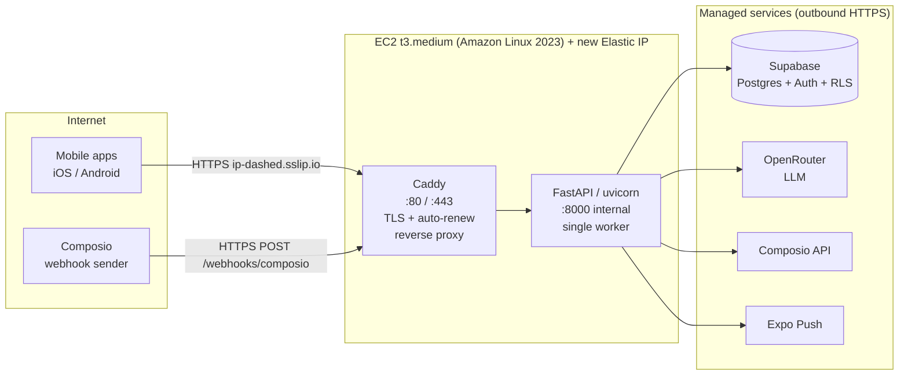

# Deployment Plan: Backend on AWS EC2

Status: draft for review. First real deployment doc for this repo.
Scope: host the FastAPI backend as an always-on, HTTPS-reachable service on EC2, with a Docker runtime, durable SSH access for Cursor, and a Phase 2 GitHub Actions CI/CD pipeline.

This plan is grounded in the current codebase, the existing `architecture.md` / `mvp-plan.md` / `setup.md`, live inspection of the AWS account, and cited web research on the HTTPS question (section 3). It does not change the app's product architecture. It only defines how and where the backend runs.

---

## 1. TL;DR (the recommendation)

- One **t3.medium** EC2 box (x86_64, Amazon Linux 2023), matching your existing `ad_analytics` box and your Intel Mac, so Docker images build locally with no cross-arch emulation.
- A **new dedicated Elastic IP** so the address never changes across stop/start. (Note: the `52.62.108.102` I earlier called "spare" is actually your `bounty_board` box's IP, so we allocate a fresh one.)
- **Docker Compose** with two containers: the FastAPI backend and **Caddy** as the TLS-terminating reverse proxy. Caddy issues and auto-renews the Let's Encrypt cert as part of the running process, with zero cron and zero manual renewal. This replaces the certbot workflow you never trusted.
- **HTTPS with a publicly trusted cert is required** (plain HTTP fails the mobile app stores; self-signed fails trust). **Decided: test the raw Elastic IP + Let's Encrypt IP certificate (certbot) first** (section 12), no domain and no sslip.io. certbot's `certbot-renew.timer` auto-handles the ~6-day IP cert. sslip.io / a domain are fallbacks only if a test gate fails. Full evidence in section 3.
- The `.pem` access problem is solved for good with three layers: key in `~/.ssh/` + a `~/.ssh/config` Host entry Cursor reads + **SSM Session Manager** as a break-glass path that works even if the key is lost.
- CI/CD (GitHub Actions) is **Phase 2**, after the box is proven serving traffic by hand.

Rough cost: **~$45/month** (t3.medium + 30 GiB disk + public IPv4). Detail in section 9.

---

## 2. Current state (grounded facts the plan relies on)

| Fact | Value | Source |
|---|---|---|
| Backend framework | FastAPI, served by uvicorn (no gunicorn) | `backend/composition.py`, `pyproject.toml` |
| Python | `requires-python = ">=3.11"`, no `.python-version` | `pyproject.toml:5` |
| Dependency manager | `uv` (lockfile at repo root); install via `uv sync --frozen` | `uv.lock`, `pyproject.toml:23-24` |
| Correct ASGI target | `backend.composition:app` with `APP_EAGER_START=1` set | `backend/composition.py:170` |
| Documented target is WRONG | `backend.main:app` has no module-level `app`; will not import | `backend/main.py:163`, `docs/mvp-plan.md:404` |
| Port convention | 8000 (chosen at the uvicorn CLI, not bound in code) | docs |
| Durable state | Supabase (managed Postgres) used as **storage only, no Supabase Auth**. No local DB, no disk writes | `commands.sh` §0 |
| Auth model | **Self-owned**: the app signs its own JWTs. `AUTH_MODE=own` (prod) or `dev` (trusts `X-User-Id`). OTP emailed via Loops | `commands.sh` §3, commit `f4d2329` |
| Per-user integrations | Each user connects their own Composio accounts; DB stores only a pointer + status + provider identity in `public.connections` | `commands.sh` §6 |
| In-memory state | Classification cache only (per-user connections are DB-backed now) | `composition.py` |
| Background jobs | None. Prefect dir is empty. Composio polls on its own infra | `architecture.md` §3, empty `prefect/` |
| Inbound endpoint | `POST /webhooks/composio`, signature-verified. **Optional** (polling works without it; needed only for real-time push). Webhook target is set in the Composio dashboard | `commands.sh` §6 |
| SSE routes | `GET /later`, `GET /later/{provider}` stream for ~1 min | `backend/main.py` |
| Tests | 384+ backend tests passing (`uv run pytest`) | `commands.sh` §4 |
| LLM | OpenRouter triage classifier (`google/gemini-2.5-flash`), built unconditionally at startup, so `OPENROUTER_API_KEY` is **required to boot**. `commands.sh` §8a had omitted it — now corrected | `openrouter.py:36`, `composition.py:71` |
| Undeclared dep | `openai` imported but not in `pyproject.toml` (only transitive in lock) | `backend/integrations/openrouter.py:14` |

### Environment variables the backend reads

Names only. Values live in the gitignored root `.env` and must be provisioned onto the box, never committed. Authoritative source: `commands.sh` §8a. Three categories: **app-level** (operator sets once, serves every user), **per-user** (nobody sets in env; each user signs up and connects their own accounts), **★ host-dependent** (value changes when the backend moves address).

| Var | Purpose | Required in prod |
|---|---|---|
| `AUTH_MODE` | `own` = self-signed JWT (prod); `dev` trusts `X-User-Id` (local only) | **Yes = `own`** |
| `AUTH_JWT_SECRET` | Secret the app signs its JWTs with. Unique per deployment; changing it logs everyone out | **Yes (secret)** |
| `AUTH_JWT_ISSUER` / `AUTH_JWT_AUDIENCE` / `AUTH_ACCESS_TTL_MIN` / `AUTH_REFRESH_TTL_DAYS` | JWT claims + token lifetimes | Optional (defaults) |
| `OTP_TTL_MIN` / `OTP_RESEND_COOLDOWN_SEC` / `OTP_MAX_ATTEMPTS` | OTP policy | Optional (defaults) |
| `LOOPS_API_KEY` | Sends the OTP email via Loops. Unset → OTP printed to the backend log | **Yes in prod (secret)** |
| `LOOPS_OTP_TRANSACTIONAL_ID` | Loops transactional template id (must expose an `otp` variable) | **Yes in prod** |
| `SUPABASE_URL` | Supabase project URL (storage) | **Yes** |
| `SUPABASE_SERVICE_ROLE_KEY` | Backend DB access, bypasses RLS; every query scoped by `user_id` in code | **Yes (secret)** |
| `SUPABASE_ANON_KEY` | Present in `.env` | Yes |
| `COMPOSIO_API_KEY` | The app's Composio account (container for all users' integrations) | **Yes (secret)** |
| `COMPOSIO_WEBHOOK_SECRET` | Verifies inbound webhooks | Yes (if webhook used) |
| `COMPOSIO_AUTH_CONFIG_{GITHUB,SLACK,GOOGLECALENDAR,LINEAR,GMAIL,GOOGLEDOCS}` | One managed-OAuth auth-config id (`ac_...`) per toolkit; the connect route 503s for any toolkit without one | **Yes, per toolkit shipped** |
| `COMPOSIO_CALLBACK_URL` | OAuth return deep-link `productivityapp://composio-callback` (host-independent) | **Yes** |
| `COMPOSIO_USER_ID` | Local-dev fallback only (in-memory connection store) | No (not in prod) |
| `OPENROUTER_API_KEY` | LLM triage classifier. **Required to boot** (`openrouter.py:36` reads it unconditionally at startup) | **Yes (secret)** |
| `OPENROUTER_BASE_URL` / `OPENROUTER_MODEL` / `LLM_DAILY_BUDGET` | Classifier endpoint / model / daily cap | Optional (defaults) |
| `CORS_ORIGINS` | ★ host-dependent; comma-separated web origins; empty is fine for a native-only app | Optional |
| `APP_EAGER_START` | Builds the module-level `app` at import (else every request 500s) | **Set to 1** |

---

## 3. The HTTPS question, resolved with evidence

You pushed back on the earlier "you must buy a domain" claim, correctly. Here is the researched, cited answer (research date 2026-07-25). Bottom line: **you need a publicly trusted TLS cert, but you do not need to buy a domain.**

### 3.1 Will plain HTTP be enough? No.

- **Mobile stores block it.** iOS App Transport Security (since iOS 9) blocks cleartext HTTP by default; Android blocks cleartext by default since API 28 (Android 9). A production App Store / Play Store build cannot talk to `http://<ip>:8000` without global exceptions (`NSAllowsArbitraryLoads`, `usesCleartextTraffic=true`) that draw App Review scrutiny and are bad practice. Sources: Apple ATS docs, Android `network-security-config` docs, OWASP MASTG (all current as of 2026).
- **Composio.** Its docs require a "publicly reachable" webhook URL and note that Composio's outbound IPs are dynamic, so you cannot IP-allowlist them; you rely on the signing secret. Every official example uses `https://`. Composio does not literally document "HTTP rejected," but HTTPS-with-a-trusted-cert is the safe and universal assumption. Source: `docs.composio.dev/docs/setting-up-triggers/subscribing-to-events`.

So even setting Composio aside, the mobile clients make plain HTTP a non-starter.

### 3.2 Can the raw AWS IP serve HTTPS? Only in ways that fail, except one.

Proven against your own `ad_analytics` box today:
- It redirects `http://15.134.98.238` to `https://15.134.98.238`, but `curl https://15.134.98.238/` fails with `SSL: no alternative certificate subject name matches target host name`. The cert is for your domain, not the IP. **A validating client (mobile app, webhook sender) rejects HTTPS on the bare IP.** This is direct evidence that the "IP with HTTPS" you remembered was self-signed / click-through, not trusted TLS.

The options for a *trusted* cert without a domain:

| Path | Works? | Reality |
|---|---|---|
| Self-signed cert on the IP | No | Rejected by iOS ATS, Android, and strict webhook senders (OWASP MASTG confirms ATS prohibits self-signed). |
| AWS `*.compute.amazonaws.com` hostname | No | Let's Encrypt **refuses by policy** (`amazonaws.com` is on the Public Suffix List). Confirmed via LE community. |
| Let's Encrypt **IP-address cert** | Yes, but fragile | GA since 2026-01-15, but **~6-day (160h) short-lived** certs requiring an ACME client that supports the profiles spec and renews aggressively. Caddy can, but the 6-day cadence is a standing liability. |
| Commercial CA IP-SAN cert | Yes, paid | Often OV (business validation paperwork), ~$44+/yr. More cost and hassle than a domain. |
| **`sslip.io` / `nip.io` magic-DNS hostname** | **Yes, clean** | `13-54-xx-xx.sslip.io` resolves to the embedded IP with zero DNS setup, and Let's Encrypt issues a **normal 90-day trusted cert** for it (it is not an AWS suffix). Works with plain Caddy/certbot. **This is the recommended zero-domain path.** |
| DuckDNS free subdomain | Yes | `something.duckdns.org` → your IP, standard 90-day LE cert via DNS-01. A fine alternative if you want a human-readable name. |

### 3.3 Recommendation

**Use a free `sslip.io` hostname in front of the new Elastic IP, with Caddy auto-issuing the Let's Encrypt cert.** `<ip-dashed>.sslip.io` resolves to the IP with zero DNS setup, and Caddy gets a standard 90-day trusted cert for it. This gives:
- A publicly trusted, auto-renewing cert, no certbot babysitting, no 6-day IP-cert cadence.
- Zero domain purchase, no reuse of any existing domain, no website.
- Full compatibility with Composio, iOS ATS, and Android with no exceptions.

Caveat: `sslip.io` is a shared free service (third-party DNS dependency + a shared Let's Encrypt rate limit), fine for launch. The optional upgrade for a paid product is a **dedicated ~$12/yr domain** for this backend alone (same Caddy setup, only the hostname differs).

**Honest caveat:** `sslip.io` is a single shared domain, so it shares a global Let's Encrypt per-domain rate limit and you depend on that free service staying up. This is fine for launch and early users. When the app is a paid product you page on, spend ~$12/yr on a real domain to remove the third-party dependency. Migrating later is a config change (new hostname in Caddy, re-point the Composio webhook, update the mobile API base URL), not a rebuild.

The webhook URL registered in Composio becomes `https://13-54-xx-xx.sslip.io/webhooks/composio` (set via the SDK `composio.triggers.set_webhook_subscription(...)`, which returns the signing secret for `COMPOSIO_WEBHOOK_SECRET`).

### 3.4 App Store / Play Store: no website or domain of your own required

Publishing does **not** require hosting a user-facing website or owning a domain. Both stores require a few public **URLs** that can be free-hosted (GitHub Pages, Notion, etc.):
- Apple: a Privacy Policy URL (mandatory) and a Support URL (mandatory).
- Google Play: a Privacy Policy URL (mandatory, strictly enforced for data-accessing apps) plus the Data Safety form.

Nuance for this app: because it connects Gmail/Slack (personal data), Google's sensitive-scope OAuth verification / CASA audit can apply. Since Composio owns the registered OAuth apps, much of that burden likely sits with Composio, not you, but confirm before Gmail ships (this is why `mvp-plan.md` sequences Gmail last). App binaries are built by EAS Build in the cloud (`setup.md:70`), so no local mobile toolchain is needed.

---

## 4. Target architecture



Key points:
- Only **80 and 443** are public. Port 8000 is internal to the Docker network, never exposed to the internet. Caddy is the only public listener. Port 80 stays open because Let's Encrypt HTTP-01 validation uses it.
- **Single uvicorn worker.** The backend keeps the classification cache in process memory (per-user connections are DB-backed in `public.connections`), so multiple workers would fragment that cache. One box, one worker is simplest; it is no longer a correctness concern.
- SSE routes (`/later`) need buffering disabled and long read timeouts in Caddy (one-line config; Caddy streams by default, unlike nginx).

---

## 5. Instance sizing

The workload is light: web request handling plus JSON, all LLM inference is remote, no local model weights, no heavy libraries. The real runtime cost is holding open SSE connections, which is I/O-bound.

**Decided: t3.medium** (2 vCPU / 4 GB, x86_64, Amazon Linux 2023). Starting one tier above small gives headroom for the in-memory caches under early multi-tenant load without a same-week resize. It matches `ad_analytics` and your Intel Mac, so Docker builds locally with no arm emulation. Resizing up (or down to t3.small) later is a stop / change-type / start, made seamless by the Elastic IP (the address survives).

Disk: **30 GiB gp3** root volume, matching your other boxes. Only container images and logs touch disk.

---

## 6. The `.pem` / never-lose-access solution

Your stated pain: you create instances, lose the key files, and later cannot get back in. Cursor's "Connect to Host" reads `~/.ssh/config`, which is how `ad_analytics` works for you today. We make that reliable and add a backstop. Confirmed on this Mac: your keys live in `~/.ssh/` (`vicky_ads.pem`, `vicky_cred.pem`, etc.) with Host entries in `~/.ssh/config`.

Three layers:

1. **Dedicated key pair, saved with the others.**
   - Generate a fresh AWS key pair named `productivity_app_prod` (independent of `vicky`, so this box's access is revocable on its own).
   - Save the private key to `~/.ssh/productivity_app_prod.pem`, `chmod 400`, next to your existing `.pem` files.
   - The private key is a secret: **never** committed to git. Back it up to your password manager (durable copy) so a Mac wipe does not lose it. Optionally mirror into AWS Secrets Manager (~$0.40/mo) as a second copy.

2. **`~/.ssh/config` Host entry** so Cursor lists it and connects with no flags:
   ```
   Host productivity_app_prod
     HostName <new-elastic-ip>
     User ec2-user
     IdentityFile ~/.ssh/productivity_app_prod.pem
     IdentitiesOnly yes
   ```
   In Cursor: Connect to Host, pick `productivity_app_prod`. Same muscle memory as `ad_analytics`.

3. **SSM Session Manager as break-glass.** Amazon Linux 2023 ships the SSM agent. Attach an IAM role with `AmazonSSMManagedInstanceCore`, and you can always open a shell via `aws ssm start-session --target <instance-id>` with **no SSH key and no open port 22**. This is the true fix for "I lost the key": AWS credentials become a permanent alternate door. SSH stays your primary Cursor path; SSM is the safety net.

After Phase 1, access is documented in this repo and backed up in your password manager, so the lockout problem does not recur.

---

## 7. HTTPS runtime: Caddy + sslip.io

Caddy fronts uvicorn in the same Compose stack. A minimal `Caddyfile`:

```
<ip-dashed>.sslip.io {           # e.g. 13-54-22-9.sslip.io ; or a dedicated domain later
    reverse_proxy backend:8000 {
        flush_interval -1        # stream SSE immediately, no buffering
        transport http {
            read_timeout 300s     # long-lived /later streams
        }
    }
}
```

- Caddy obtains the Let's Encrypt cert on first request (HTTP-01 over port 80), then renews it in the background for the life of the process. No certbot, no cron.
- `sslip.io` needs no DNS setup: the hostname encodes the Elastic IP. Because the Elastic IP is stable, the hostname is stable.
- Switching host later (sslip.io → a dedicated domain) is a one-line `Caddyfile` change plus re-pointing the Composio webhook and the mobile API base URL. No rebuild.

Rejected for now: **AWS ALB + ACM** (managed certs, but ~$16 to $20/mo plus a load balancer in front of a single box we deliberately do not horizontally scale). Revisit only if we move off single-instance.

---

## 8. Phased plan

Tracer-bullet ordering: prove one real webhook event flows end to end through the deployed box before adding automation or hardening.

### Phase 0: Decisions and pre-deploy code fixes (before touching AWS)

Backend changes follow Red-Green-Refactor (a failing test first where a function changes).

- [ ] Confirm and document the ASGI launch target `backend.composition:app` + `APP_EAGER_START=1`. Fix the stale `backend.main:app` reference in `docs/mvp-plan.md:404`.
- [ ] Add `openai` as an explicit dependency in `pyproject.toml` (currently only transitive). Re-lock with `uv lock`.
- [ ] Confirm the app boots with `AUTH_MODE=own` + a strong unique `AUTH_JWT_SECRET`, plus `LOOPS_API_KEY` + `LOOPS_OTP_TRANSACTIONAL_ID` for real OTP email (prod must not run `dev`/`X-User-Id`).
- [ ] Resolve the two known items from `setup.md`: rotate the leaked Supabase service-role key, and fix the Composio wrong-project connection so the SDK sees the accounts.
- [ ] Confirm the one open decision in section 10 (sslip.io vs a purchased domain).

### Phase 1: Tracer bullet, the thinnest always-on HTTPS slice (manual, provisioned via AWS CLI)

Goal: a real Composio event reaches the deployed backend over trusted HTTPS and lands in Supabase, and you can SSH in from Cursor.

- [ ] AWS CLI (each command captured into a re-runnable `provision.sh`): create security group (`productivity_app_sg`) allowing **443 and 80 from anywhere** (80 for LE validation), **22 from your IP only**; allocate a **new** Elastic IP; create an IAM role + instance profile with `AmazonSSMManagedInstanceCore`; run the t3.medium instance from the AL2023 AMI with the new `productivity_app_prod` key; associate the EIP.
- [ ] Save the key to `~/.ssh/productivity_app_prod.pem`, add the `~/.ssh/config` Host block, back the key up to your password manager, confirm Cursor "Connect to Host" works.
- [ ] Install Docker + Docker Compose on the box (via user-data).
- [ ] Add `Dockerfile` (python:3.12-slim + uv, `uv sync --frozen`, run `uvicorn backend.composition:app --host 0.0.0.0 --port 8000`), `docker-compose.yml` (backend + caddy), and `Caddyfile` (sslip.io host) to the repo.
- [ ] Copy `.env` to the box (chmod 600, outside git), set `APP_EAGER_START=1`, `AUTH_MODE=own`, and all six `COMPOSIO_AUTH_CONFIG_*` ids.
- [ ] `docker compose up -d`. Confirm `https://<ip-dashed>.sslip.io/` serves with a valid trusted cert.
- [ ] Re-register the Composio webhook to `https://<ip-dashed>.sslip.io/webhooks/composio`. Trigger one real event (a Slack DM, as verified 2026-07-23) and confirm it flows in and stores to Supabase.
- [ ] Point the mobile app's `EXPO_PUBLIC_API_URL` at the sslip.io URL and confirm `GET /feed` over HTTPS.

Exit criteria: box always-on, trusted HTTPS valid, one real webhook processed, Cursor SSH works, key backed up.

### Phase 2: CI/CD with GitHub Actions

Only after Phase 1 is serving traffic. Follows the validate-then-deploy rule; mirrors `ad_analytics/.github/workflows/deploy.yml`.

- [ ] `validate` job on the GitHub runner: `uv sync --frozen`, `pytest` (the 384+ test suite), and (if Dockerized) `docker compose config --quiet` + a `docker build`. No production secrets on the runner.
- [ ] `deploy` job with `needs: validate` (runs only on green): reach the box (prefer SSM-based deploy, no new inbound port), pull new code/image, `docker compose up -d`, then poll a health endpoint.
- [ ] Add a lightweight `GET /health` route if none exists, for the post-deploy check.
- [ ] Do not widen the security group for the pipeline.

### Phase 3: Hardening and operability

- [ ] Confirm 8000 is not internet-exposed (only 80/443 public, 22 to your IP).
- [ ] Automated EBS snapshots (a daily Data Lifecycle Manager policy) so the box is restorable.
- [ ] Basic CloudWatch alarm on instance status and high CPU.
- [ ] Confirm SSM break-glass works (open a session with SSH intentionally unavailable).
- [ ] Document restart-survival: what rehydrates on `docker compose restart` vs what is lost (section 11).

---

## 9. Cost estimate (ap-southeast-2, approximate, verify against the calculator)

| Item | Monthly |
|---|---|
| t3.medium on-demand (24/7) | ~$38 |
| 30 GiB gp3 root volume | ~$3 |
| Public IPv4 (Elastic IP, always charged) | ~$3.6 |
| HTTPS (Let's Encrypt IP cert via certbot) | $0 |
| Optional: key in Secrets Manager | ~$0.40 |
| **Total** | **~$45/month** |

A savings plan / reserved instance cuts compute ~30% once the box is permanent. This is on top of the ~$2.40/mo the stopped `openclaw-hermes-stack` disk still costs, droppable by terminating it once you are sure it is dead.

---

## 10. Decisions

Locked:

| Decision | Choice |
|---|---|
| Instance | t3.medium, x86_64, Amazon Linux 2023 |
| Elastic IP | New, allocated fresh (not the `bounty_board` IP) |
| Key pair | New `productivity_app_prod`, saved to `~/.ssh/` + password-manager backup |
| Infra as code | AWS CLI (first-timer choice); each command captured into a re-runnable `provision.sh` so you still get a reproducible record |
| HTTPS | Raw Elastic IP + Let's Encrypt **IP certificate** via certbot + nginx (test first, section 12). sslip.io / a domain are fallbacks only if a gate fails. |

HTTPS approach (decided 2026-07-25): **test the raw-IP + LE IP-cert path first** (section 12), no domain, no sslip.io. Runtime for this path is **nginx + certbot** (mirroring `ad_analytics`), not Caddy. If a test gate fails, fall back to sslip.io, then to a domain you already own. Everything in the test is created new and isolated (section 12.2).

---

## 11. Open risks and pre-prod correctness items

- **In-memory classification cache** (was "connection identity"). Per-user connections are now persisted in `public.connections` (`commands.sh` §6), so a restart no longer drops connected accounts. The only remaining in-process state is the classification cache, which is a performance cache, not correctness: run a single uvicorn worker and a restart simply re-warms it. No longer a redeploy blocker.
- **Single instance is a deliberate ceiling.** Horizontal scaling is blocked by the in-memory state above. Scale vertically until that state moves to Supabase. Fine for MVP and early tenants.
- **Webhook secret is load-bearing.** `COMPOSIO_WEBHOOK_SECRET` must be set in prod. Composio's outbound IPs are dynamic, so you cannot firewall-allowlist them; the signature secret is the only authentication on the public endpoint.
- **Service-role key rotation.** The leaked Supabase service-role key (bypasses RLS) must be rotated before this box is internet-facing (Phase 0).
- **sslip.io dependency.** If chosen, the app's public hostname depends on a free third-party DNS service and a shared Let's Encrypt rate limit. Acceptable for launch; move to a paid domain when it becomes a product you page on.
- **No feature-flag rollback shims.** Rollback here is redeploy the previous image / `git revert`, not a runtime toggle.

---

## Appendix: why not the alternatives

- **Not Railway/Render/Fly**, though `architecture.md:77` suggests them for ~$5/mo. Simpler, but you specifically want EC2 + Cursor SSH + your own Docker control, and you already operate EC2. Staying on EC2 keeps this consistent with `ad_analytics`.
- **Not Vercel.** Serverless timeouts (10s on hobby) would cut the batched LLM summarization and the minute-long SSE streams. Explicitly rejected in `architecture.md:79` and `mvp-plan.md:416`.
- **Not the AWS EC2 MCP server.** It is a thin wrapper over the same AWS API the CLI already reaches. With the CLI configured, driving provisioning directly (captured into `provision.sh`) gives the same capability. Terraform is the more reproducible long-term choice; we are using the CLI now because it is your first time and every step stays visible.
- **Self-signed and the AWS `*.compute.amazonaws.com` hostname stay out** (section 3). The **bare IP is not out**: Let's Encrypt now issues IP certificates, and we test that path first (section 12). certbot's old limitation was the classic domain-only flow, not an absolute impossibility.

---

## 12. Raw-IP HTTPS hypothesis test (run this first)

Decided 2026-07-25: before committing to any hostname, test whether the backend can run on a fresh EC2 + Elastic IP served over trusted HTTPS via a **Let's Encrypt IP certificate** (certbot), with Composio delivering webhooks to that IP URL. No domain, no sslip.io. The certbot `certbot-renew.timer` handles the ~6-day IP-cert renewal automatically, the same mechanism already running on `ad_analytics`.

> **Reconciliation note (2026-07-25).** `commands.sh` (committed in `ec451ac` / `943d033`) is now the authoritative runbook, and section 2 of this plan was updated to match it: self-owned `AUTH_MODE=own` JWT auth + Loops OTP (no Supabase Auth), six `COMPOSIO_AUTH_CONFIG_*` ids, connections persisted in `public.connections`, 384+ tests. **One open conflict remains:** `commands.sh` §9 still documents HTTPS as **Caddy + sslip.io**, while this section tests **raw IP + certbot**. They are alternatives, not both. Once this test resolves, `commands.sh` §9 and sections 3/7/8 here should be updated to the winner. Confirm the raw-IP direction still stands before we provision.

### 12.1 The three make-or-break gates

1. **Gate 1 (issuance):** certbot obtains a trusted LE IP certificate for the Elastic IP. If the installed certbot cannot (the IP/short-lived profile is new), fall back to lego or Caddy to still prove HTTPS-on-IP works, and report which client succeeded.
2. **Gate 2 (acceptance):** Composio accepts an IP-based HTTPS webhook URL (unverified today; some webhook senders reject IP literals).
3. **Gate 3 (delivery):** Composio delivers a real event to the IP URL and the backend processes it into Supabase.

### 12.2 Isolation guarantees (nothing existing is touched)

Every resource is created new and dedicated. Explicitly:

- **New key pair** `productivity_app_test`. Existing keys (`vicky`, `vicky_ads`, etc.) untouched.
- **New security group** `productivity_app_test_sg` in the default VPC. Creating a new SG does not read, edit, or delete the default SG or any existing SG. No existing rule is modified.
- **New Elastic IP**, freshly allocated. Not `bounty_board`'s `52.62.108.102`, not `ad_analytics`' `15.134.98.238`.
- **New EC2 instance** with its own EBS volume.
- **No IAM changes.** SSM/break-glass is deferred, so no role, policy, or instance profile is created or modified. Nothing touches permissions aligned with your other services. (If SSM is added after the test, it will be a new instance-scoped role only.)
- **Repo access via a new read-only deploy key** scoped to this one repo. Your personal SSH key and all other repos are untouched.
- **Composio:** only the productivity-app webhook subscription is changed, snapshotted first and restored after. No other app's Composio config is touched.
- **No changes** to the default VPC, subnets, route tables, or any running instance (`ad_analytics`, `openclaw-hermes-stack`, `bounty_board`).

Blast radius of the entire test = the new resources listed in 12.3. Teardown (12.7) removes them and returns the account to its exact pre-test state.

### 12.3 Resource inventory

| Created new (this test only) | Never touched |
|---|---|
| Key pair `productivity_app_test` | All existing key pairs |
| Security group `productivity_app_test_sg` | `default`, `launch-wizard-*`, `bounty-board-sg` |
| One Elastic IP (fresh) | EIPs `15.134.98.238`, `52.62.108.102` |
| One EC2 instance + its EBS volume | `ad_analytics`, `openclaw-hermes-stack`, `bounty_board` |
| One GitHub deploy key (read-only, this repo) | Your personal SSH key, all other repos |
| (temporary) productivity-app webhook URL | Every other Composio app/config |

### 12.4 Step-by-step

**Phase A: Provision (all new)**
- A1. Detect your current public IP (to lock SSH to it).
- A2. Create key pair `productivity_app_test`, save to `~/.ssh/productivity_app_test.pem` (chmod 400), add a `~/.ssh/config` Host entry.
- A3. Allocate a new Elastic IP.
- A4. Create `productivity_app_test_sg`: inbound 22 from your IP/32, 80 + 443 from anywhere, outbound all.
- A5. Launch the AL2023 instance (size per 12.5) with the new key + SG.
- A6. Associate the Elastic IP; wait for running + 2/2 status checks.

**Phase B: Code + secrets**
- B1. SSH in; generate a deploy key on the box (`ssh-keygen -t ed25519`).
- B2. **[YOUR STEP]** Paste the public key into `agentiwise-lab/productivity-app` → Settings → Deploy keys, read-only. I pause here for ~30 seconds.
- B3. `git clone` the repo over SSH.
- B4. `scp` the `.env` to the box (chmod 600, never via git). For the test it must carry the prod-shape values from `commands.sh` §8a: `AUTH_MODE=own`, a strong `AUTH_JWT_SECRET`, the six `COMPOSIO_AUTH_CONFIG_*` (already created for this account, §6), `COMPOSIO_CALLBACK_URL`, the Supabase keys, `COMPOSIO_API_KEY`, and Loops vars (or leave Loops unset to read the OTP from the log).
- B5. Install Python 3.11 + uv; `uv sync` (mirror `commands.sh` §9a).

**Phase C: Gate 1, HTTPS on the IP**
- C1. Install nginx + certbot.
- C2. Attempt an LE IP certificate for the Elastic IP (certbot, HTTP-01 on port 80). If certbot's version lacks IP support, fall back to lego/Caddy.
- C3. Verify externally: `openssl`/`curl https://<IP>/` shows a valid, trusted cert naming the IP. **Record Gate 1 result.**

**Phase D: Backend behind nginx**
- D1. nginx config: 443 → uvicorn on :8000, proxy buffering off, long read timeouts (for the SSE `/later` routes).
- D2. Run `uvicorn backend.composition:app` (`APP_EAGER_START=1`, `AUTH_MODE=own`) as a systemd service (mirror `commands.sh` §9b).
- D3. Confirm `https://<IP>/` serves the API.

**Phase E: Gates 2 & 3, Composio over the IP**
- E1. Snapshot the current Composio webhook subscription.
- E2. Set the webhook target to `https://<IP>/webhooks/composio` in the **Composio dashboard** (`commands.sh` §6; the webhook is optional and only powers real-time push, but the IP URL is exactly what we're testing). **Record Gate 2 result: does Composio accept an IP-literal HTTPS URL?**
- E3. Sign in (email + OTP + password) and connect one account (the six auth configs already exist, `commands.sh` §6), then fire a real event (e.g. a Slack DM, as verified 2026-07-23); confirm it is processed into Supabase (logs + DB). **Record Gate 3 result.**
- E4. Restore the original webhook subscription.

**Phase F: Report + decide** (matrix in 12.6).

### 12.5 What's required from you

1. **Go/no-go** to create the new billable EC2 + Elastic IP.
2. **Instance size:** t3.medium (becomes prod if the test passes) or t3.small (cheaper throwaway).
3. **The one manual step:** add the deploy key at B2.
4. **Approve `scp` of `.env`** to the box.
5. **Approve the temporary webhook repoint** (snapshot + restore) and confirm a **working Composio connected account** exists to fire a test event (the `setup.md` "wrong project → 0 accounts" issue resolved or not).

### 12.6 Decision matrix

- **All three pass** → promote this box to prod: keep the certbot IP cert + renew timer, optionally Dockerize, harden (SSM, snapshots, restrict SSH), and update sections 5 to 10 to record raw-IP as the chosen HTTPS.
- **Gate 1 fails** (no client can issue an IP cert) → raw-IP path is dead; fall back to sslip.io.
- **Gate 2 fails** (Composio rejects the IP URL) → raw-IP path is dead for webhooks; fall back to sslip.io (a name Composio will accept).
- **Gate 3 fails while 1 and 2 pass** → HTTPS and acceptance are fine; the problem is the connected-account/event path (likely the wrong Composio project), not the IP approach.

### 12.7 Teardown / rollback (if we abandon the test)

1. Restore the Composio webhook subscription (if not already).
2. Terminate the EC2 instance.
3. Release the Elastic IP.
4. Delete the security group `productivity_app_test_sg`.
5. Delete the AWS key pair; remove the local `.pem` and the `~/.ssh/config` entry.
6. Remove the deploy key from the repo.

Net result: the AWS account and GitHub repo return to their exact pre-test state.

### 12.8 Cost of the test

t3.medium ~$38/mo prorated (t3.small ~$19), Elastic IP ~$3.6/mo, 30 GiB disk ~$3/mo. A few days of testing is a few dollars. If promoted to prod, it becomes the section 9 figure.

### 12.9 Test results (2026-07-25) — hypothesis CONFIRMED

Provisioned resources (all new, isolated): instance `i-0890354b08bca1c00` (t3.medium, AL2023), Elastic IP **`52.64.67.235`** (`eipalloc-056cb2601879bbaaf`), SG `productivity_app_test_sg` (`sg-0d374ba0556b75951`), key `productivity_app_test`.

- **Gate 1 (HTTPS on the raw IP): PASS — but only via lego, not certbot.**
  - **certbot 4.2.0 REFUSES bare IPs client-side**: "The Let's Encrypt certificate authority will not issue certificates for a bare IP address." certbot has the `--preferred-profile` flag but has not implemented IP identifiers. So the plan's "certbot for the IP cert" assumption is wrong.
  - **lego v5.3.1 with `run --profile shortlived` SUCCEEDED**: Let's Encrypt issued a cert for `52.64.67.235` (HTTP-01 on port 80). Issuer `Let's Encrypt`, `X509v3 SAN: critical, IP Address:52.64.67.235`, validity ~6 days (Jul 25 → Aug 1, the shortlived profile).
  - Served via nginx on 443; **externally validated from a normal client** (`curl` from the Mac, `ssl_verify_result=0`, HTTP 200). Trusted HTTPS on the raw Elastic IP is real.
- **Gate 2 (Composio accepts an IP webhook URL): PASS.** `composio.triggers.set_webhook_subscription(webhook_url="https://52.64.67.235/webhooks/composio")` was **accepted** (subscription `ws_Kzyij_17gwHi`, V3, `composio.trigger.message`). The prior value was the dead 2026-07-23 ngrok URL, so nothing production was overwritten. The webhook signing secret in `.env` matches the subscription (deliveries will verify). 7 connected accounts (Slack/Gmail/Linear/Calendar/GitHub, several ACTIVE) and 4 active triggers exist — the old "wrong project → 0 accounts" issue is resolved.
- **Gate 3 (real delivery + processing):** backend deployed (systemd `productivity-backend`, `AUTH_MODE=own`, app builds and serves — `/feed` → 401, webhook route → 405 to GET, all over the trusted HTTPS-on-IP path). Signature verification is wired and the secret matches. Awaiting a natural event from an active Slack/GitHub trigger to observe an end-to-end delivery.

**Consequences for the runtime (correct the earlier assumptions):**
1. **Use lego, not certbot**, to issue and renew the IP certificate. certbot cannot do it.
2. **Renewal is NOT handled by `certbot-renew.timer`** (there is no certbot cert). The ~6-day lego cert needs its own **systemd timer / cron running `lego renew` every few days**, or switch the front to **Caddy** (which auto-renews IP certs natively). This is the one real operational cost of the raw-IP path.
3. Everything else (raw IP + trusted HTTPS + Composio acceptance + backend) is validated. The raw-IP, no-domain path works.
